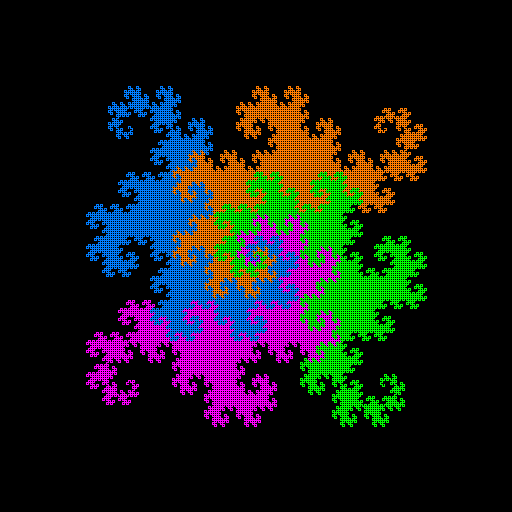

# The Dragon Curve
I was bored in real analysis class and started drawing the dragon curve. After developing an algorithm to help me draw it I thought, "Hey, I can do this in code!", so I learned a whole new programming language just to do it.

